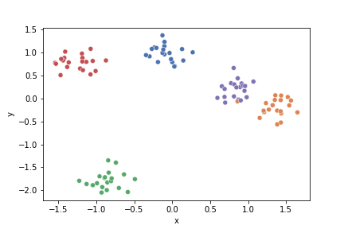

# K-means

## Used Google Colab to learn
Part of an assignment for Machine Learning and Knowledge Discovery CSC 430
Create a K-means, understand it, implement

## Plotting the the data and centroids
## Before

## After

